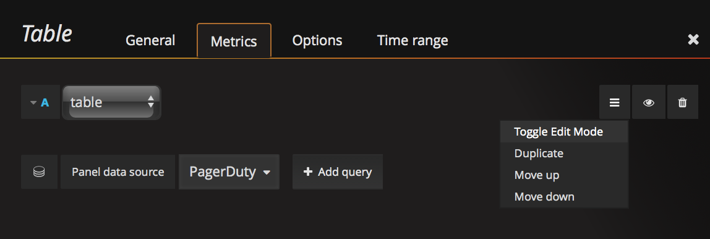
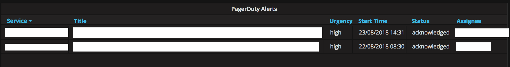
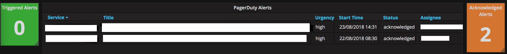

<h2>PagerDuty datasource: A datasource to view alerts in grafana.</h2>

Save time by viewing your open alerts and whos assigned to them from within grafana, saving you from having to switch to another dashboard.</>

  

[][license]

[][https://github.com/davidferdinand/pagerduty_graf_datasource/watchers]
[][https://github.com/davidferdinand/pagerduty_graf_datasource/stargazers]

### Requirements

Ruby 2.4.x  
PagerDuty token saved as environment variable `PAGERDUTY_TOKEN`

___

This app uses the PagerDuty API to get alert info and parses it for Grafana to a format accepted by [Simple JSON Datasource](https://github.com/grafana/simple-json-datasource).

- `/` is a health check, returning a 200 status
- `/search` returns a formatted list of PagerDuty services
- `/query` returns either a count of incidents or incident data

## /search

PagerDuty's 'services' endpoint is queried to return a list of all services. We use the format of 'Team.MonitoringTool' for our services. This is parsed to give a list of unique Teams.

This is then displayed in Grafana for the user to select.

## /query

PagerDuty's 'incident' endpoint is queried to return a list of all current alerts.
The selected 'Team' from Grafana is passed back to the app, the relevant alerts are then displayed in Grafana.

If a table has been selected, full alert info is shown.
If single stat has been selected, a count of alerts is shown.

## Use in Grafana

The PagerDuty datasource can be used with the 'Table' and 'Single Stat' panels.

To view your team's alerts in table format add the Table panel and select the 'PagerDuty' datasource from the list.

Then enter your team's name in the text box that appears, the names available are the first part of the pagerduty service.

Once the team name has been entered the table will be created as below:

The same process will be followed for single stat boxes. These will display a count of current alerts by team.

If `.trig` is added to the end of the team name (e.g. `Team1.trig`) only alerts in the triggered state will be displayed.

If `.ack` is added to the end of the team name (e.g. `Team1.ack`) only alerts in the acknowledged state will be displayed.

For an example of how it can be used we have the following set up.

